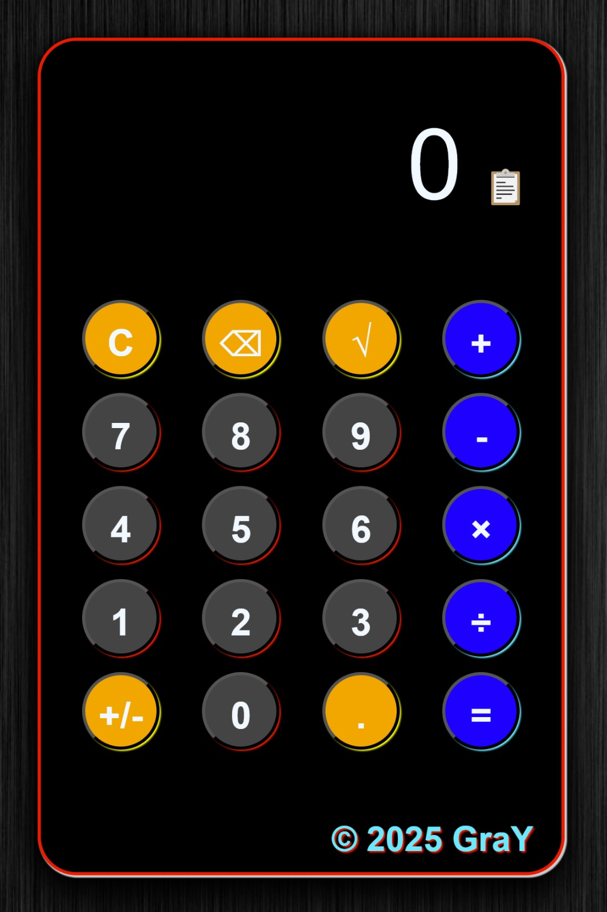

# 3D Calculator Vue



A stylish 3D calculator built with Vue 3, featuring tilt animations, mouse interactivity, copy-to-clipboard, custom design, and responsive layout.

## 🚀 Live Demo

[View Online (Netlify)](https://3d-calculator-vue.vercel.app/)  

## 🛠️ Features

- **3D Tilt Animation** — The calculator visually responds to mouse movement.
- **Standard Operations** — Addition, subtraction, multiplication, division, square root, plus/minus.
- **Copy Result** — Copy the result to clipboard with one click (📋).
- **Custom Design** — Dark theme, colored buttons, animated hover effects.
- **Responsive Layout** — Works great on both desktop and mobile.
- **Input Limitations** — Prevents overflow, handles invalid input, and protects against errors.
- **Built with Vue 3** — Uses `<script setup>` and Composition API for clean, modern code.

## ✨ Screenshots

  

## 🖥️ How to Run Locally

```bash
git clone https://github.com/GrayMurakami/3d-calculator-vue.git
cd 3d-calculator-vue
npm install
npm run dev
